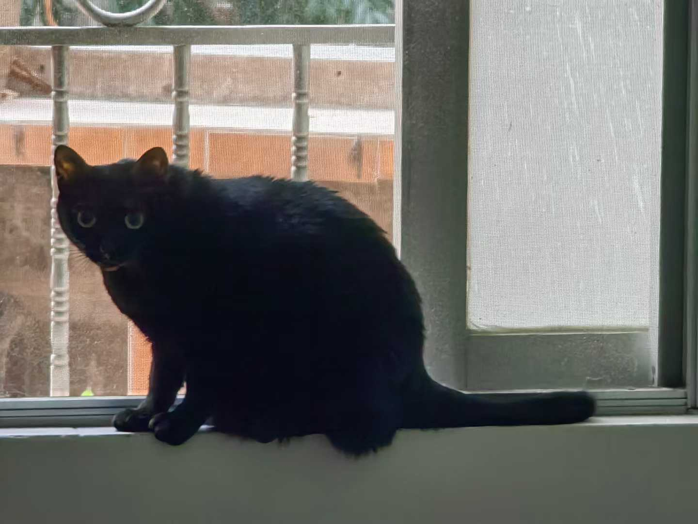
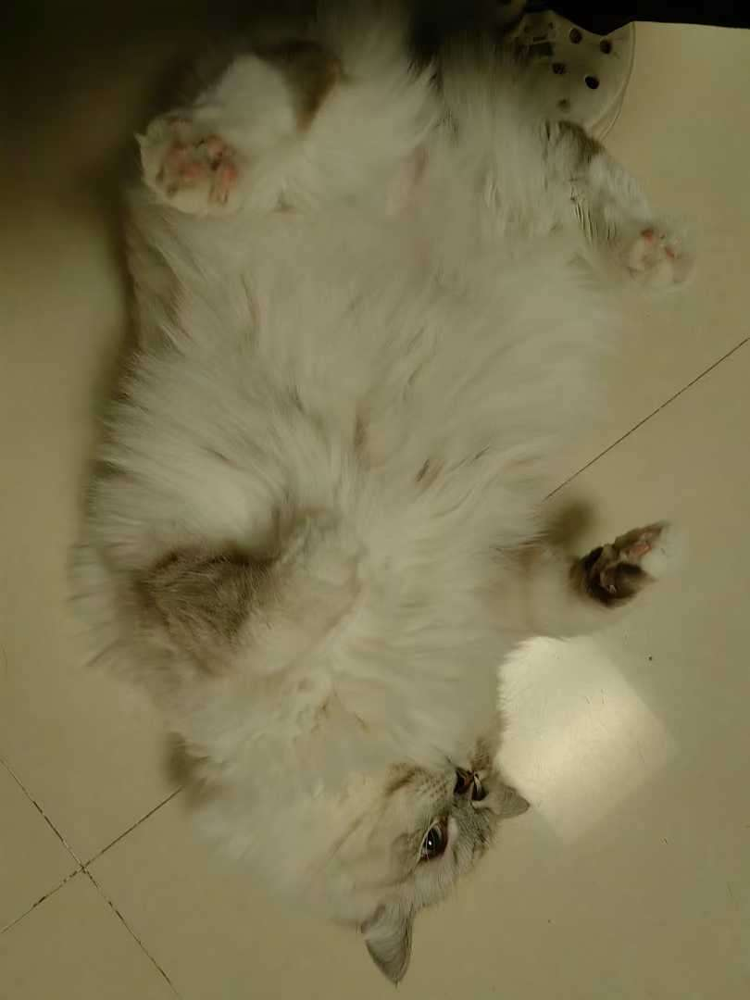
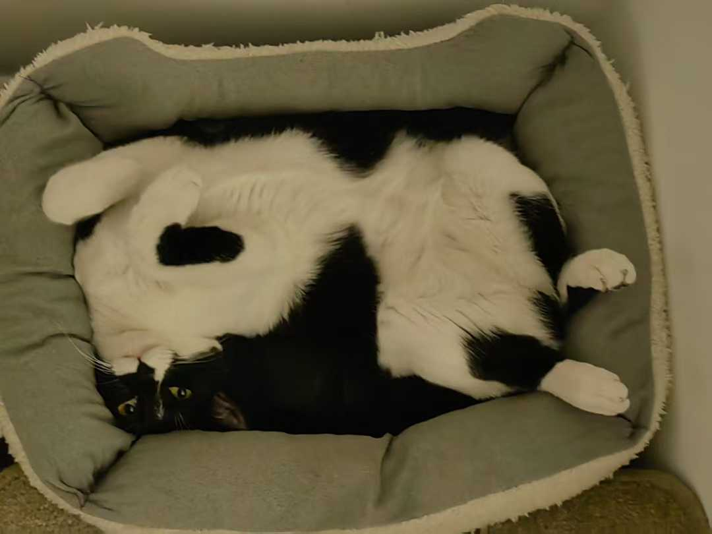

# CSE110 Lab 1 <!-- first title -->

## introduction
Hello everyone.  
This is the page of **UCSD** *25SP* **CSE 110** *Lab 1*.    
~~Actually I don't know what else to write about~~    
~~So what follows is basically literally written as required.~~

## quoting text
> Quoting text 1  
>   Quoting text 2  
>       Quoting text 3   

## quoting code
`print("Quoting code 1")`  
```python
def Quoting(): print("Quoting code block")
Quoting()
``` 

## External Links (Link to another webpage)
[just a random link](https://www.youtube.com/watch?v=IxX_QHay02M)  

## Section links (Link to a header in the same .md file)
[skip to introduction](#introduction)  

## Relative links (Link to another .md file or an image in your repo. If linking to an image, encode it as a regular link rather than an image.)
[link to README](README.md)  
[*hehe*](images/8.jpg)  

## Ordered and Unordered Lists
### ordered
1. first
2. second
3. third

### unordered
- program A
- program B
- program C

## Task lists
- [x] task 1
- [ ] task 2
- [ ] task 3

## And then there's nothing else, just my cats




